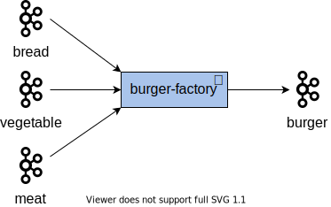

= 🥋 Karate  🥰 ❄️ Snowflake
:source-highlighter: highlight.js
:highlightjs-languages: gherkin
:icons: font

🇫🇷 _Ne ratez pas votre SQL avec un test Karate_

🇬🇧 _Don't break your SQL code with a Karate test_

== 🪄 Once upon a time... ✨
[%step]
A great data pipeline !

[%step]
image::images/data-pipeline-simple.png[]

[%notitle]
=== Lectra Context
image::diagrams/iot.svg[background,size=contain]

=== $ whoami 👨‍💻
[%step]
* Mehdi REBIAI
* 🧑‍🔧 Tech Lead & Data Engineer @Lectra
* icon:github[] https://github.com/mrebiai
* https://github.com/lectra-tech/kapoeira[Kapoeira Maintainer]

=== A great pipeline... but sometimes... 😥
[%step]
Not so great... more complex

[%step]
image:images/data-pipeline-dirty.jpg[height=290] image:images/data-pipeline-complex.jpg[height=290]

=== 💡We need Tests 🤗 & QA 🕵️ 🐛
[%step]
But also some tools...

== Let's talk about architecture 👷
ETL vs ELT...

[%notitle]
=== ETL
image::diagrams/data-pipeline-etl.svg[background,size=contain]

=== image:images/snowflake-text.png[]
[%step]
* Data Cloud... DBMS++
* Snowpark, Stream/Task...
* STORAGE 💰 dissociated from COMPUTE 💰💰💰
* Scalable COMPUTE

[.columns]
=== image:images/kapoeira-text.svg[width=100]
[.column]
[%step]
* Kafka IT tests (☕ / 🐳)
* Gherkin & Cucumber (Scala)
* Code: https://github.com/lectra-tech/kapoeira[^]
* Slides: https://jvauchel.github.io/kapoeira-dance/[^]

[.column]
[%step]
video::ELFCAgdgSro[youtube, width=500]

=== Kapoeira - Example (1/2)

=== Kapoeira - Example (2/2)
[source, gherkin]
----
include::features/kapoeira/burger-factory.feature[]
----

[%notitle]
=== ELT
image::diagrams/data-pipeline-elt.svg[background,size=contain]

=== image:images/dbt-text.svg[width=200]
[%step]
* Python tool for data transformation
* SQL generation through Jinja2 templates
* Code: https://github.com/dbt-labs/dbt-utils[^]
* Since `v1.8`, https://docs.getdbt.com/docs/build/unit-tests[unit tests^]

[.columns]
=== image:images/karatelabs.png[width=200]
[.column]
[%step]
* REST API tests, and more... (☕)
* Gherkin
* Code: https://github.com/karatelabs/karate[^]

[.column]
[%step]
video::NYlPxd5dZOU[youtube, width=500]

=== Karate - Example
[source, gherkin]
----
include::features/karate/hello-world.feature[]
----

=== Karate - HTTP+++ +++Snowflake - JDBC SQL+++ +++🤔
[%step]
* https://docs.snowflake.com/en/developer-guide/snowflake-rest-api/snowflake-rest-api[Snowflake REST API & Authentication^]
* https://docs.snowflake.com/developer-guide/snowflake-cli/index[Snowflake CLI^] (JWT generation,...)
* https://docs.snowflake.com/en/developer-guide/sql-api/index[Snowflake SQL API^]
* 😃

=== Karate/Snowflake - Example
[source, gherkin]
----
include::features/karate/select-v1.feature[]
----

[.columns]
=== Complex for a SELECT...😠+++ +++Run Task & DBT ?🤔
[.column]
image::diagrams/data-pipeline-elt.svg[width=500]

[.column]
[%step]
* Karate DSL extension - https://github.com/karatelabs/karate-examples[Examples^]
* `karate.exec(<any_command>)`
* 😃

[.columns]
== 💡 `karate-connect`+++ +++🧩 extensions
[%step]
[.column width="65%"]
* ☕ `karate-connect-standalone.jar`
** ☕ `karate-core.jar` image:images/karatelabs.png[width=60]
** ☕ `karate-connect.jar` 
*** 🧩 `snowflake`, `kubernetes`
*** +++
+++🧩 `rabbitmq`, `kafka`+++
+++

[%step]
[.column]
* 🐳 `karate-connect` 
** ☕ `karate-connect-standalone.jar`
** 🛠️ `dbt`, `kubectl`, `snowflake-cli`

=== How to run ?
[%step]
.☕
[source, bash]
----
java -Dextensions=<ext1,ext2...> \
    -jar karate-connect-standalone.jar \
    <features_path> <optional_params...>
----

[%step]
.🐳
[source, bash, indent=0]
----
docker run --rm \
  -v $(pwd)/<features_path>:/features \
  -v $(pwd)/<reports_path>:/target \
  -e KARATE_EXTENSIONS=<ext1,ext2...>  -e ... \
  karate-connect:latest <optional_params...>
----

=== How to customize ?
.`karate-config.js`
[source, javascript]
----
function fn() {
  const mySuperFunction = (input) => input.toUpperCase();
  return {
    "projectName": "mySuperProject",
    "myFunction": mySuperFunction
  };
}
----

See https://karatelabs.github.io/karate/#environment-specific-config[karate documentation^] for file location

[.columns]
=== `snowflake` extension config
[%step]
[.column]
--
[source, bash]
.`cli-config`
----
SNOWFLAKE_ACCOUNT=xxx.west-europe.azure
SNOWFLAKE_USER=MY_USER
SNOWFLAKE_PRIVATE_KEY_PATH=/my-path/private-key.pem
PRIVATE_KEY_PASSPHRASE=my-passphrase
----

[source, javascript]
----
{ 
  "account": "xxx.west-europe.azure",
  "user": "MY_USER",
  "privateKeyPath": "/my-path/private-key.pem",
  "privateKeyPassphrase": "my-passphrase"
}
----
--

[%step]
[.column]
--
.`snowflake-config`
[source, bash]
----
SNOWFLAKE_DATABASE=MY_DB
SNOWFLAKE_SCHEMA=MY_SCHEMA
SNOWFLAKE_ROLE=MY_ROLE
SNOWFLAKE_WAREHOUSE=MY_WH
----

[source, javascript]
----
{
  "database": "MY_DB",
  "schema": "MY_SCHEMA"
  "role": "MY_ROLE",
  "warehouse": "MY_WH"
}
----
--

=== `snowflake` extension
* Config with env vars, JS files...
* JWT generation
* SQL execution (with retry, timeout...)
* Upload CSV/JSON into Table
* Clone / Drop schema
* And more...😃

=== Karate/Snowflake - Example
[source, gherkin]
----
include::features/karate/select-v2.feature[]
----

[.columns]
== Demo Time 🎬
[%step]
[.column]
Kafka version+++ +++

[%step]
[.column]
Snowflake version+++ +++image:diagrams/burger-factory.svg[width=400]

=== DDL
image::diagrams/ddl.svg[width=600]

=== How to run ?
[%step]
.☕
[source, bash, indent=0]
----
include::demo.sh[tags=karate_jar]
----

[%step]
.🐳
[source, bash, indent=0]
----
include::demo.sh[tags=karate_docker]
----

=== `burger-factory.feature`
[source, gherkin]
----
include::burger_factory/it/features/burger-factory.feature[]
----

=== Clone schemas...
[source, gherkin]
----
include::burger_factory/it/features/burger-factory-clone-schemas.feature[]
----

== Next Steps 🚀
* Extension `kafka`
* Extension `jdbc`?

[background-color="white"]
[.columns]
== 🉠Thank you - Questions?+++ +++🥋🥰â„ï¸
[.column]
Slides 🖥️::
image:images/qrcode-slides.png[width=300]

[.column]
Feedback🙏::
image:images/qrcode-feedback.png[width=300]